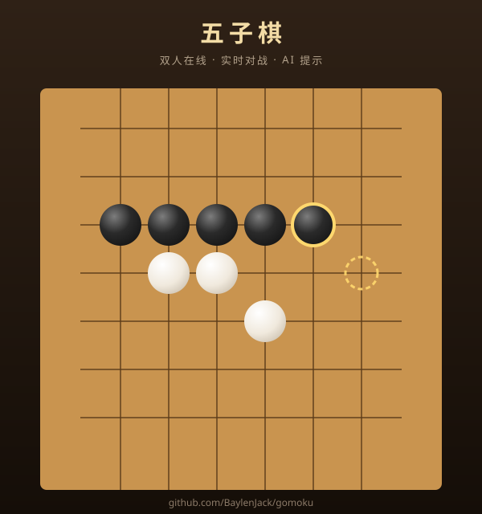

# 🎱 五子棋 (Gomoku Online)

> 双人在线五子棋 —— 实时对战、AI 提示、断线重连、棋局持久化。自部署，零成本。

[](LICENSE)
[](https://nodejs.org)
[](https://developer.mozilla.org/zh-CN/docs/Web/API/WebSocket)
[](CONTRIBUTING.md)

<p align="center">
  
</p>

## ✨ 这是什么

两个人的在线五子棋，**打开浏览器就能玩**，无需下载、无需注册：

- ♟️ **15×15 标准棋盘**，黑先，五连即胜（长连也算胜）
- 🤖 **AI 提示** —— 点一下按钮，本地 AI 引擎（无需服务器）推荐下一步
- ⚡ **实时对战** —— WebSocket 落子即时同步，双方看到同一副棋盘
- 💾 **棋局持久化** —— 服务器存棋局，随时下线，回来接着下
- 🔌 **断线重连** —— 网络抖动自动重连，凭本地 token 认领原座位
- 🏆 **每局交换先手** —— 抵消五子棋先手优势（五子棋先手优势极大）
- 🧮 **悔棋**（需对方同意）、**计时器**（默认关）、**胜利高光连线**
- 📱 **手机友好** —— 触屏优化，自适应布局
- 🎨 **实木质感 UI** —— 程序化木纹棋盘、立体棋子、暖金主题

**和别的五子棋区别**：完全自部署、开源、服务端是唯一权威（前端无法作弊）、棋局永不丢失。

## 🎬 效果

- **实木棋盘**：程序化生成的木纹、年轮、细密丝纹，每局都独一无二
- **立体棋子**：径向渐变 + 高光 + 投影，黑白子都有真实体积感
- **AI 提示**：淡金色呼吸圆环标记推荐落点（提示引擎纯本地计算，零延迟）
- **胜利动画**：五子连线金色光晕高亮 + 落子回弹动画

## 🚀 5 分钟部署

### 本地跑

```bash
git clone https://github.com/BaylenJack/gomoku.git
cd gomoku
npm install
npm start
```

浏览器打开 `http://localhost:8080/`。两个浏览器窗口各开一个，输相同房间名即可对弈。

### 公网部署（和女朋友异地玩）

**最简单 — Cloudflare Tunnel（不需要备案）**

```bash
# 1. 安装 cloudflared
# 2. 登录并创建隧道
cloudflared tunnel login
cloudflared tunnel create gomoku
# 3. 写配置 ~/.cloudflared/config.yml:
#    tunnel: <your-tunnel-id>
#    ingress:
#      - hostname: game.yourdomain.com
#        service: http://127.0.0.1:8080
#      - service: http_status:404
# 4. DNS 路由 + 启动
cloudflared tunnel route dns gomoku game.yourdomain.com
cloudflared tunnel run gomoku
```

**有 VPS**：Node 20+ 直接跑，systemd 守护配置见 `deploy/`。

## 📁 项目结构

```
gomoku/
├── src/
│   ├── game.js            # 规则核心（纯函数：胜负判定/悔棋/校验）
│   ├── room.js            # 房间逻辑（座位/token 认领/悔棋协商/换先手）
│   ├── server.js          # WebSocket + HTTP 服务
│   └── store.js           # JSON 快照持久化（原子写入）
├── public/
│   ├── index.html         # 界面
│   ├── style.css          # 实木暖金主题
│   ├── app.js             # 前端逻辑（渲染/交互/断线重连）
│   └── hint.js            # AI 提示引擎（本地启发式 + 一层前瞻）
├── test/
│   ├── game.test.js       # 规则单元测试（18 项）
│   ├── hint.test.js       # AI 引擎测试（8 项）
│   └── e2e.mjs            # 端到端测试（25 项）
├── deploy/
│   ├── systemd.service    # Linux 守护
│   └── README.md          # 部署指南
├── package.json
├── README.md
└── LICENSE
```

## ⚙️ 规则

- 15×15，黑先，横/竖/斜连成 **5 子或以上**即胜（自由五子棋 Freestyle）
- 无禁手（那是连珠 Renju 的规则，休闲玩家门槛太高）
- 棋盘下满无五连 = 和棋
- 每局交换先手，抵消先手优势

## 🧪 测试

```bash
npm test
```

- ✅ 规则单测 18 项：五连判定/长连/边界/悔棋/合法性校验
- ✅ AI 引擎 8 项：跳三识别/双威胁/防守优先级/反杀规避
- ✅ 端到端 25 项：座位分配/实时同步/断线重连/悔棋协商/胜负判定

## 🛠️ 技术栈

- **后端**：Node 20+，`ws`，零数据库（JSON 快照，原子写入）
- **前端**：原生 JavaScript + Canvas（程序化木纹渲染），零框架
- **传输**：WebSocket 双向通信，服务端唯一权威（防作弊）

## 🤝 贡献

欢迎 PR！请先看 [CONTRIBUTING.md](CONTRIBUTING.md)。

特别欢迎：
- 🎨 新主题（暗色 / 清新风）
- 🤖 AI 引擎强化（三手前瞻 / 开局库）
- 📊 棋谱回放功能
- 🌐 i18n 国际化

## 📜 协议

[MIT License](LICENSE) — 随便用，可商用。

## 🙏 致谢

AI 提示引擎参考了五子棋/连珠的威胁评估理论。
界面设计灵感来自实木棋盘的自然质感。

---

<p align="center">
  <sub>用 ❤️ 写给异地的人</sub>
</p>